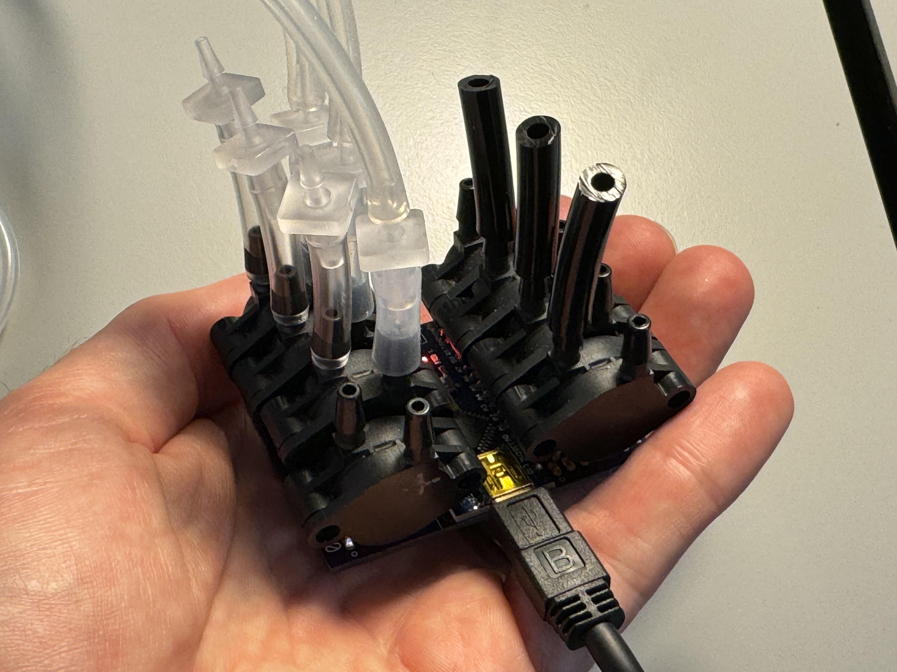

# Pressurama multi-channel pressure logger

Using default Python installation from python.org

Program your Arduino using the file

    pressurama-arduino/pressurama-arduino.ino

Dependencies for pressurama-gui data plotter/saver:

    pip3 install pyserial
    pip3 install dearpygui

Dependencies for plotters:

    pip3 install matplotlib

